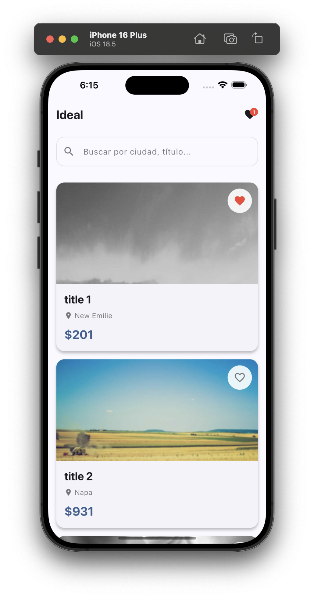
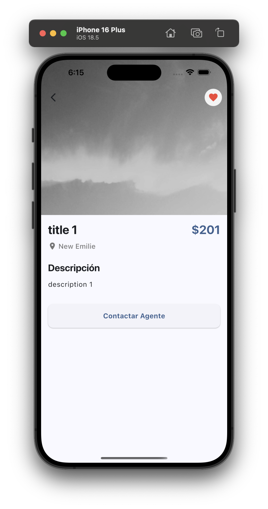

# Ideal - Real Estate App 🏡

Una aplicación Flutter para explorar propiedades inmobiliarias con búsqueda, favoritos y navegación intuitiva.

## 📸 Capturas de Pantalla

<p align="center">
  
  
</p>

## 🎥 Demo

https://github.com/user-attachments/assets/demo.mp4

<!-- Si prefieres un enlace directo al video -->

[Ver video de demostración](docs/demo.mp4)

## 🏡 Características

### ✨ Funcionalidades Principales

- **Autenticación**: Sistema de login con validación y almacenamiento seguro de tokens
- **Lista de propiedades**: Navegación con scroll infinito y paginación inteligente
- **Búsqueda con debounce**: Filtro optimizado por título o ciudad (500ms de espera)
- **Filtros avanzados**: Por ciudad, rango de precio y ordenamiento
- **Favoritos persistentes**: Marca propiedades como favoritas con almacenamiento local
- **Detalles completos**: Vista detallada con SliverAppBar colapsable y Hero animations
- **Perfil de usuario**: Pantalla de perfil con información y navegación a favoritos/ajustes
- **Configuración**: Tema (sistema/claro/oscuro), idioma (ES/EN), moneda (USD/EUR)
- **Internacionalización**: Soporte completo para español e inglés
- **Shimmer loading**: Efectos de carga tipo skeleton para mejor UX
- **Navegación protegida**: Rutas con guards de autenticación usando GoRouter
- **Cache de imágenes**: Carga optimizada con cached_network_image

### 🎨 Diseño y UX

- **Material Design 3**: Diseño moderno y consistente
- **SliverAppBar colapsable**: Header que se colapsa al scrollear para más espacio
- **Temas personalizados**: Sistema/Claro/Oscuro con cambio dinámico
- **Modo oscuro**: Soporte completo con colores optimizados
- **Animaciones**: Hero animations en imágenes de propiedades
- **Badge de favoritos**: Contador visual en el AppBar
- **Estados de carga**: Shimmer placeholders en lugar de spinners
- **Empty states**: Mensajes contextuales con CTAs cuando no hay resultados

## 🛠️ Tecnologías

### Core

- **Flutter SDK**: ^3.9.2 - Framework principal multiplataforma
- **Dart SDK**: ^3.9.2 - Lenguaje de programación

### Estado y Navegación

- **flutter_riverpod**: ^2.5.1 - Gestión de estado reactiva y robusta con StateNotifier
- **go_router**: ^14.2.7 - Navegación declarativa con guards de autenticación

### Networking y Persistencia

- **HTTP**: ^1.2.2 - Cliente HTTP para consumo de APIs
- **shared_preferences**: ^2.3.2 - Persistencia local de preferencias y favoritos
- **flutter_secure_storage**: ^9.2.4 - Almacenamiento seguro de tokens de autenticación
- **MockAPI.io**: Servicio de API REST simulada

### Internacionalización

- **flutter_localizations**: SDK - Localización de Flutter
- **intl**: ^0.20.2 - Formateo de números, fechas y monedas (USD/EUR)
- **ARB files**: Sistema de traducción con app_es.arb y app_en.arb

### UI y Assets

- **cached_network_image**: ^3.4.1 - Cache inteligente de imágenes con rendimiento optimizado
- **shimmer**: ^3.0.0 - Efectos de carga skeleton para mejor UX
- **rxdart**: ^0.28.0 - Streams reactivos para debounce de búsqueda (500ms)

### Herramientas de Desarrollo

- **very_good_analysis**: ^6.0.0 - Reglas de linting estrictas para código de calidad
- **JSON Annotation**: ^4.9.0 - Anotaciones para serialización JSON
- **JSON Serializable**: ^6.8.0 - Generación automática de código para modelos
- **Build Runner**: ^2.4.13 - Herramienta de generación de código

## 📱 Estructura del Proyecto

```
lib/
├── core/
│   ├── app.dart                    # MaterialApp con router y localización
│   ├── di.dart                     # Inyección de dependencias
│   ├── theme.dart                  # Temas Material 3 (claro/oscuro)
│   └── router/
│       └── app_router.dart         # GoRouter con guards de autenticación
├── features/
│   ├── auth/
│   │   ├── data/
│   │   │   └── auth_repository.dart       # Repositorio de autenticación
│   │   ├── domain/
│   │   │   └── auth_state.dart            # Estados de autenticación
│   │   ├── presentation/
│   │   │   └── screens/
│   │   │       └── login_screen.dart      # Pantalla de login
│   │   └── providers/
│   │       └── auth_provider.dart         # Provider de autenticación
│   ├── profile/
│   │   └── presentation/
│   │       └── screens/
│   │           └── profile_screen.dart    # Pantalla de perfil de usuario
│   ├── settings/
│   │   ├── data/
│   │   │   ├── preferences_service.dart   # Servicio de preferencias
│   │   │   └── settings_repository.dart   # Repositorio de configuración
│   │   ├── domain/
│   │   │   └── settings_state.dart        # Estado de configuración
│   │   ├── presentation/
│   │   │   └── screens/
│   │   │       └── settings_screen.dart   # Pantalla de ajustes
│   │   └── providers/
│   │       └── settings_provider.dart     # Provider de settings
│   └── properties/
│       ├── data/
│       │   ├── properties_repository.dart # Repositorio de propiedades
│       │   └── favorites_repository.dart  # Repositorio de favoritos
│       ├── domain/
│       │   ├── property.dart              # Modelo de propiedad
│       │   └── filters_state.dart         # Estado de filtros
│       ├── presentation/
│       │   ├── screens/
│       │   │   └── property_detail_screen.dart  # Detalle con SliverAppBar
│       │   └── widgets/
│       │       ├── property_card.dart           # Card reutilizable
│       │       ├── shimmer_placeholder.dart     # Skeleton loader
│       │       ├── search_bar_widget.dart       # Búsqueda con debounce
│       │       └── filter_bar.dart              # Filtros (ciudad, precio, sort)
│       └── providers/
│           ├── properties_provider.dart         # Provider de propiedades
│           ├── favorites_provider.dart          # Provider de favoritos
│           ├── filters_provider.dart            # Provider de filtros
│           └── filtered_properties_provider.dart # Combinación de filtros
├── l10n/
│   ├── app_localizations.dart      # Clase generada de localizaciones
│   ├── app_en.arb                  # Traducciones en inglés (60+ keys)
│   └── app_es.arb                  # Traducciones en español (60+ keys)
├── models/
│   └── paginated_response.dart     # Modelo de respuesta paginada
├── screens/
│   ├── home_screen.dart            # Pantalla principal con SliverAppBar
│   └── favorites_screen.dart       # Pantalla de favoritos
├── services/
│   └── currency_formatter.dart     # Formateador USD/EUR
└── main.dart                       # Punto de entrada con ProviderScope

l10n.yaml                           # Configuración de generación l10n
pubspec.yaml                        # Dependencias y assets

test/
└── widget_test.dart                # Tests de widgets

docs/
├── home.png                        # Screenshots
├── detail.png
└── demo.mp4                        # Video demostración
```

## 🚀 Configuración

### Prerrequisitos

- Flutter SDK (3.35.3 o superior)
- Dart SDK
- IDE compatible (VS Code, Android Studio)

### Instalación

1. **Clonar el repositorio**

   ```bash
   git clone <repository-url>
   cd ideal
   ```

2. **Instalar dependencias**

   ```bash
   flutter pub get
   ```

3. **Generar código JSON**

   ```bash
   dart run build_runner build
   ```

4. **Configurar MockAPI** (Opcional)

   El proyecto está configurado para usar MockAPI.io. Si quieres usar tu propio endpoint:

   - Ve a [mockapi.io](https://mockapi.io)
   - Crea un nuevo proyecto
   - Crea un recurso llamado `properties`
   - Usa los datos de ejemplo en `assets/sample_properties.json`
   - Actualiza la URL en `lib/services/property_api_service.dart`

5. **Ejecutar la aplicación**
   ```bash
   flutter run
   ```

## 📊 API Endpoints

La aplicación utiliza los siguientes endpoints de MockAPI:

- `GET /properties` - Lista todas las propiedades
- `GET /properties?page=1&limit=10` - Paginación
- `GET /properties/:id` - Obtiene una propiedad específica
- `GET /properties?search=query` - Búsqueda (implementada localmente)

### Estructura de datos

```json
{
  "id": "1",
  "title": "Lujoso Apartamento en el Centro",
  "city": "Barcelona, España",
  "price": 2500000,
  "image": "https://picsum.photos/800/600?random=1",
  "description": "Descripción detallada de la propiedad..."
}
```

## 🎨 Diseño

La aplicación sigue los principios de Material Design 3 con:

### Sistema de Temas

- **Colores**: Esquema basado en azul (#1976D2) como color primario
- **Tema Claro**: Optimizado para uso diurno con alta legibilidad
- **Tema Oscuro**: Reduce fatiga visual en ambientes de baja luz
- **Cambio Dinámico**: Botón en AppBar para alternar entre temas
- **Configuración Centralizada**: Archivo `theme.dart` con toda la configuración

### Componentes Personalizados

- **Cards**: Bordes redondeados de 16px con elevación sutil
- **Botones**: Formas redondeadas de 12px consistentes
- **Inputs**: Estilo filled con bordes redondeados
- **AppBar**: Sin elevación con scrolledUnderElevation
- **Chips**: Bordes redondeados de 8px

### Detalles de UX

- **Tipografía**: Jerarquía clara con pesos y tamaños definidos
- **Espaciado**: Consistente usando múltiplos de 8px
- **Animaciones**: Hero transitions para continuidad visual
- **Estados de Carga**: Shimmer placeholders en lugar de spinners genéricos
- **Feedback Visual**: Badges, tooltips y estados hover/pressed

## 🧪 Testing

La aplicación cuenta con una suite de tests completa:

### Ejecutar todos los tests

```bash
flutter test
```

### Tests implementados (7 tests ✅)

1. **App loads correctly** - Verifica que la app carga correctamente
2. **Search bar is present and accepts input** - Prueba funcionalidad de búsqueda
3. **Favorites button is visible** - Verifica presencia del botón de favoritos
4. **Loading state appears initially** - Comprueba estados de carga
5. **Favorites icon button is tappable** - Verifica interactividad
6. **Theme toggle button is visible and works** - Prueba cambio de tema
7. **Theme toggle button exists** - Confirma presencia del botón de tema

### Cobertura

Los tests cubren:

- ✅ Carga inicial de la aplicación
- ✅ Widgets principales (AppBar, SearchBar, Cards)
- ✅ Interacciones de usuario (búsqueda, favoritos)
- ✅ Sistema de temas (toggle claro/oscuro)
- ✅ Navegación básica

### Ejecutar tests específicos

```bash
# Solo tests de widgets
flutter test test/widget_test.dart

# Test específico
flutter test --plain-name "Theme toggle button is visible and works"
```

## 📱 Funcionalidades Principales

### 🔐 Autenticación

- **Login con validación**: Email debe contener '@', contraseña mínimo 6 caracteres
- **Almacenamiento seguro**: Tokens guardados en flutter_secure_storage
- **Guards de rutas**: Redirección automática si no estás autenticado
- **Logout**: Limpieza completa de sesión y redirección a login

### 🏠 Pantalla Principal (Home)

- **SliverAppBar colapsable** con búsqueda que se expande/colapsa
- **Lista de propiedades** con imágenes en alta calidad y paginación
- **Barra de búsqueda** en tiempo real con debounce de 500ms
- **Filtros avanzados**:
  - Ciudades con chips seleccionables
  - Rango de precio con RangeSlider (0 - 1M)
  - Ordenamiento: Precio (bajo-alto), Precio (alto-bajo), Ciudad (A-Z)
  - Botón de limpiar filtros cuando hay filtros activos
- **Scroll infinito** para carga progresiva (10 items por página)
- **Shimmer loading** mientras se cargan las propiedades
- **Badge de favoritos** con contador en el AppBar
- **Botón de perfil** con acceso a configuración
- **Hero animations** en las imágenes de propiedades
- **Empty states** con mensajes contextuales y CTAs

### 🏡 Pantalla de Detalle

- **SliverAppBar** con imagen grande y Hero animation
- **Información completa**: título, precio formateado, ubicación, descripción
- **Precio con formato**: Cambia entre USD/EUR según configuración
- **Botón de favorito flotante** con estado sincronizado
- **Navegación suave** con transición animada
- **Scroll view** expandible para contenido largo
- **Traducciones completas** en ES/EN

### ❤️ Pantalla de Favoritos

- **Lista de propiedades favoritas** persistente con SharedPreferences
- **Estado vacío** con ilustración cuando no hay favoritos
- **Contador** de favoritos en el header y badge
- **Sincronización** automática al marcar/desmarcar
- **Mismo diseño** que la pantalla principal para consistencia
- **Navegación** a detalle con Hero animation

### 👤 Pantalla de Perfil

- **Información del usuario**: Nombre, email, avatar
- **Estadísticas**: Contador de favoritos
- **Navegación rápida**: Botones a Favoritos y Configuración
- **Logout**: Cerrar sesión con confirmación
- **Diseño Material 3**: Cards con elevación y espaciado consistente

### ⚙️ Pantalla de Configuración

- **Tema**: Sistema / Claro / Oscuro con RadioListTile
- **Idioma**: Español / English con cambio en tiempo real
- **Moneda**: USD / EUR con actualización reactiva en toda la app
- **Limpiar caché**: Botón para resetear favoritos y preferencias
- **Persistencia**: Todas las configuraciones se guardan en SharedPreferences
- **Traducciones completas**: Todos los textos localizados

### 🌐 Internacionalización (i18n)

- **Soporte completo** para Español e Inglés
- **60+ traducciones**: Todas las pantallas y componentes
- **Cambio en tiempo real**: Sin reiniciar la app
- **Formato de moneda**: USD ($1,234.56) / EUR (1.234,56 €)
- **ARB files**: Sistema estándar de Flutter para l10n
- **Generación automática**: Clases generadas con flutter gen-l10n

### 🔍 Búsqueda y Filtros

- **Debounce de 500ms**: Reduce llamadas innecesarias
- **Búsqueda reactiva**: Actualización automática de resultados
- **Filtrado combinado**: Búsqueda + ciudad + precio + sort
- **Feedback visual**: Indicador de filtros activos
- **Limpieza fácil**: Botón para resetear todos los filtros
- **Estado persistente**: Los filtros se mantienen durante la sesión

## 🔧 Arquitectura

La aplicación sigue principios de **Clean Architecture** con separación de responsabilidades:

### Capas de la Arquitectura

#### 📱 Presentation Layer (Screens & Widgets)

- **Screens**: `home_screen.dart`, `property_detail_screen.dart`, `favorites_screen.dart`
- **Widgets**: Componentes reutilizables (`property_card.dart`, `search_bar_widget.dart`, etc.)
- **Responsabilidad**: UI y manejo de interacciones del usuario

#### 🔄 Application Layer (Providers)

- **Providers**: Estado reactivo con Riverpod
- **Notifiers**: Lógica de negocio (`PropertiesNotifier`, `FavoritesNotifier`, `ThemeModeNotifier`)
- **Responsabilidad**: Gestión de estado y coordinación entre capas

#### 🎯 Domain Layer (Models)

- **Models**: `property.dart`, `paginated_response.dart`
- **Responsabilidad**: Entidades de negocio y reglas de dominio

#### 🏗️ Infrastructure Layer (Services)

- **Services**: `property_api_service.dart`, `favorites_service.dart`
- **Configuración**: `di.dart` (inyección de dependencias), `router.dart`, `theme.dart`
- **Responsabilidad**: Acceso a datos externos, persistencia y configuración

### Optimizaciones de Rendimiento

#### 🚀 Isolates para JSON Parsing

```dart
// Parsing en isolate separado para evitar bloqueo del UI thread
final properties = await compute(_parseJsonList, response.body);
```

#### 💾 Cache de SharedPreferences

```dart
// Instancia cacheada para evitar múltiples llamadas a getInstance()
SharedPreferences? _cachedPrefs;
```

#### ⏱️ Debounce en Búsqueda

```dart
// RxDart con 500ms de espera para reducir llamadas a API
_searchSubject.debounceTime(Duration(milliseconds: 500))
```

#### 🖼️ Cache de Imágenes

```dart
// CachedNetworkImage para evitar recargas innecesarias
CachedNetworkImage(cacheKey: property.id)
```

### Gestión de Estado con Riverpod

#### Providers Principales

**Autenticación**

- `authProvider` - Estado de autenticación (logged in/out, user info)
- `authRepositoryProvider` - Repositorio de autenticación con flutter_secure_storage

**Configuración**

- `settingsProvider` - Estado de configuración (tema, idioma, moneda)
- `preferencesServiceProvider` - Servicio de SharedPreferences

**Propiedades**

- `propertiesNotifierProvider` - Lista de propiedades con paginación
- `favoritesNotifierProvider` - Lista de favoritos persistente
- `filtersProvider` - Estado de filtros (ciudad, precio, sort)
- `filteredPropertiesProvider` - Combinación de búsqueda + filtros + propiedades
- `searchQueryProvider` - Query de búsqueda actual
- `availableCitiesProvider` - Lista de ciudades únicas para filtro

**Navegación**

- `goRouterProvider` - Router con guards que verifican `authProvider`

#### Ventajas de Riverpod

- ✅ **Type-safe**: Detección de errores en tiempo de compilación
- ✅ **Testeable**: Fácil de mockear y probar con overrides
- ✅ **Dispose automático**: Limpieza automática de recursos
- ✅ **Dev tools**: Inspección de estado en tiempo real
- ✅ **No BuildContext**: Providers accesibles desde cualquier lugar
- ✅ **Composable**: Providers que dependen de otros providers
- ✅ **Reactive**: Rebuilds automáticos cuando cambia el estado

## 🚀 Próximas Mejoras

### ✅ Implementado

- [x] Sistema de autenticación con login/logout
- [x] Almacenamiento seguro de tokens (flutter_secure_storage)
- [x] Guards de autenticación en rutas (GoRouter)
- [x] Pantalla de perfil de usuario
- [x] Pantalla de configuración completa
- [x] Sistema de temas: Sistema/Claro/Oscuro
- [x] Internacionalización ES/EN con 60+ traducciones
- [x] Formato de moneda USD/EUR reactivo
- [x] Filtros avanzados (ciudad, precio, ordenamiento)
- [x] SliverAppBar colapsable en Home
- [x] Shimmer loading effects
- [x] Debounce en búsqueda (500ms)
- [x] Hero animations en imágenes
- [x] Badge de favoritos con contador
- [x] Pantalla de favoritos completa
- [x] Empty states contextuales
- [x] Optimización con compute() para JSON parsing
- [x] Cache de SharedPreferences
- [x] Arquitectura por features

### 🔄 En Progreso

- [ ] Tests unitarios y de integración
- [ ] Persistencia de filtros en SharedPreferences
- [ ] AnimatedSwitcher para transiciones suaves
- [ ] HTTP interceptor con Authorization header
- [ ] Refresh indicator en listas

### 🎯 Roadmap Futuro

- [ ] Integración con API real de propiedades
- [ ] Mapa con ubicación de propiedades (Google Maps/Mapbox)
- [ ] Chat con agentes inmobiliarios
- [ ] Notificaciones push para propiedades favoritas
- [ ] Modo comparación de propiedades
- [ ] Galería de imágenes en detalle (swipeable)
- [ ] Calculadora de hipoteca
- [ ] Tours virtuales 360°
- [ ] Compartir propiedades en redes sociales
- [ ] Historial de propiedades vistas
- [ ] Filtros guardados personalizados
- [ ] Modo offline con sincronización
- [ ] Autenticación con Google/Apple
- [ ] Perfil editable con foto
- [ ] Dashboard con estadísticas

### Recursos Externos

- [Flutter Documentation](https://docs.flutter.dev/)
- [Riverpod Documentation](https://riverpod.dev/)
- [GoRouter Documentation](https://pub.dev/packages/go_router)
- [Material Design 3](https://m3.material.io/)

## 📄 Licencia

Este proyecto es un ejemplo educativo y de demostración. Siéntete libre de usar el código para aprendizaje y proyectos personales.

## 📞 Contacto

Para preguntas, sugerencias o colaboraciones:

- 📧 Email: [luisguillermo.rodriguez32@gmail.com]
- 🌐 Website: [guilleperez.com]

---

<p align="center">
  Hecho con ❤️ usando Flutter
</p>

<p align="center">
  
  
  
  
  
  
</p>
